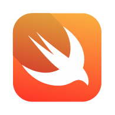

# Swift-Playground
##### by
#### Israel Manzo

*Apple Developer source*  [Swift](https://developer.apple.com/swift/)



This repository will review strings, integers, duobles, booleans, functions, classes and more swift properties and methods.
Este repository revisa propiedades, metodos, funciones y variables en el lenguage the programacion swift.

## Variables
> Variable is a value that can change, depending on conditions or on information passed to the program.
> > Variable is un valor que cambia, dependiendo de condiciones o informacion pasada al programa.

> Variables are mutable
> > Variables pueden ser alteradas

> Constants are not mutables
> > Constantes no pueden ser cambiadas, alteradas o mutadas

### String
> In computer programming, a string is traditionally a sequence of characters, either as a literal constant or as some kind of variable.
> > En lenguaje the programacion, un string es tradicionalmente una sequencia de caracteres, en una variable o en una constante.

#### Example:

```swift
var letra = "A" 
let palabra = "Me" 
var stringWord:String = "Buenos Dias"

var word = "a"
var sentence = "Hello, how are you today?"
var paragraph = "This is a test to create an paragraph to demostrate a string. Esta linea es para aprender que 
```

### Integers
> Int is a fundamental type built into the compiler and used to define numeric variables holding whole numbers.
> > Integer es un tipo fundamental construido en el compailer y usado para definir variables numericas, soportado por numeros.

#### Example:
```swift
var number = 2
var integer = 120
```

## Doubles
> Double is a fundamental type built into the compiler and used to define numeric variables holding numbers with decimal points, which accommodate fractions.
> > Dobles es un tipo fundamental construido en el compailer y usado para definir variables numericas que contienen decimales, la cual acomoda fracciones.

#### Example:
```swift
var double = 0.1123
var other = 0.5
```
## Boolean
> In computer science, the Boolean data type is a data type, having two values (usually denoted true and false), intended to represent the truth values of logic and Boolean algebra.
> > En ciencias de computacion, los tipo boolean es tipo de datos, tienen dos valores (usualmente denotados como verdadero o falso), intentando representar el verdadero valor de la logica algebraica.

#### Example:
```swift
var a = 2
var b = 3

// a is not equal to b
a == b <- False

let day = "Monday"
let firstDay = "Monday"

// day is equal to firstDay
day == firstDay <- True
```

## Arrays
> In computer science, array programming languages (also known as vector or multidimensional languages) generalize operations on scalars to apply transparently to vectors, matrices, and higher-dimensional arrays.
> > En ciencias de computacion, programa de lenguaje array (tambien conocido como vector o multidimensional lenguaje) generaliza operaciones para aplicar transparencia a vectores, matrices y altas dimensiones de colleccion.

#### Example:
```swift
// String array
var words = ["Hello", "World", "Hola"]

// Int Array
var numbers = [1, 2, 3, 4, 5]

// Double Array
var doubles = [0.1, 0.2, 0.3, 0.4, 0.5]

```

## Conditional "if" statement

> Use if to specify a block of code to be executed, if a specified condition is true. Use else to specify a block of code to be executed, if the same condition is false. Use else if to specify a new condition to test, if the first condition is false.
> > Se usa if especificamente en block de codigo a ser executado, si la condicion es verdadera. Se usa tambien para saber si la condicion es falsa. 

#### Example:
```swift
if "John" == "Johnny" {
    
    print("The are the same guy")
    
} else {
    
    print("The are not the same guy")
    
}
```

## For in loop
> You use the for-in loop to iterate over a sequence, such as items in an array, ranges of numbers, or characters in a string.
> > Se usa el for-in loop para iterar/numerar sobre una sequencia, una collection/array, rango de numeros, o caracteres de un string.

#### Example:
```swift
for number in [1,2,3,4,5] {
    print(number) // this will print each number in the array
}


// We give the array a container
// Ponemos el array de numeros in a container

let numbers = [4,3,5,12,67]

for i in numbers {
    print(i)
}

```
## Closures

> Closures are self-contained blocks of functionality that can be passed around and used in your code. Closures in Swift are similar to blocks in C and Objective-C and to lambdas in other programming languages.

> Closures can capture and store references to any constants and variables from the context in which they are defined. This is known as closing over those constants and variables. Swift handles all of the memory management of capturing for you.

[Closures documentation](https://developer.apple.com/library/content/documentation/Swift/Conceptual/Swift_Programming_Language/Closures.html)

```swift
// The way a function gets called
func helloWorld(word: String) -> String {
    return "Function call -> \(word)"
}


// Function with complition handler
func helloWorldWithCompletionHandler(word: String, completionHandler: (_ name: String)-> Void){
    let myName = word + " " + "World"
    completionHandler(myName)
}

helloWorldWithCompletionHandler(word: "Hello") { (e) in
    print("Function with completion handler call -> \(e)")
}


// Closure procedure
let closureHelloWorld = {(word: String) -> String in
    return "Closure call -> \(word)"
}


```

>> A trailing closure is written after the function call's parentheses, even though it is still an argument to the function. When you use the trailing closure syntax, you don't write the argument label for the closure as part of the function call.

[Closures documentation](https://developer.apple.com/library/content/documentation/Swift/Conceptual/Swift_Programming_Language/Closures.html)

```swift
// Trailing closure sample
func functionWithClosure(name: String, completionHandler:(_ data: String, _ response: String, _ error: String)->()){
    completionHandler("data", "response", "error")
}

// Trailing closure calls
functionWithClosure(name: "Hello World") { (data, response, error) in
    print(data, response, error)
}

// print should be: "data", "response", "error"

functionWithClosure(name: "Hello World", completionHandler: {
    print("$0: \($0), $1: \($1), $2: \($2)")
})

// print should be: "$0: data, $1: response, $2: error"

```

## Collections

>  Swift provides three primary collection types, known as arrays, sets, and dictionaries, for storing collections of values. Arrays are ordered collections of values. Sets are unordered collections of unique values. Dictionaries are unordered collections of key-value associations.

[Collections documentation](https://developer.apple.com/library/content/documentation/Swift/Conceptual/Swift_Programming_Language/CollectionTypes.html)

### Arrays

```swift
var numbers = [1, 2, 3, 4, 5, 6, 7, 8, 9, 10]

var evenNumbers = [Int]()

for num in numbers {
    let squr = num * num
    if squr % 2 == 0 {
        evenNumbers.append(squr)
    }
}

let sqrNumbers = numbers.map {$0 * $0}.filter {$0 % 2 == 0}
// print the square of multiples of all pairs numbers


// Pairing elements of two array in one array
let suit = ["♡", "♢", "♤", "♧"]
let rank = ["J", "K", "Q", "A"]

var pairs = [(String, String)]()

for s in suit {
    for r in rank {
        let p = (s, r)
            pairs.append(p)
        }
}

let cards = suit.flatMap { s in
    rank.map { r in (s, r)}
}
// print [("♡", "J"), ("♡", "K"), ("♡", "Q"), ("♡", "A"), ("♢", "J"), ("♢", "K"), ("♢", "Q"), ("♢", "A"), ("♤", "J"), ("♤", "K"), ("♤", "Q"), ("♤", "A"), ("♧", "J"), ("♧", "K"), ("♧", "Q"), ("♧", "A")]
```

### Sets

> You use a set instead of an array when you need to test efficiently for membership and you aren’t concerned with the order of the elements in the collection, or when you need to ensure that each element appears only once in a collection.

[Sets documentation](https://developer.apple.com/documentation/swift/set)


```swift
let barca: Set = ["Messi", "Suarez", "Iniesta", "Xavi", "Rivaldo", "Kluiver", "Eto"]
let sudamericans: Set = ["Messi", "Suarez", "Rivaldo"]

// Substraction the matching elements
let matchingPlayers = barca.subtracting(sudamericans)
// print the substraction remainded of matching elements

// Intersecting matching elements
let intersectingPlayers = barca.intersection(sudamericans)
// print the elements intersected

// Union - will not duplicate elements but return one
let allPlayers = barca.union(sudamericans)
// print the union of all elements without repeat it
```

## Enums

> An enumeration defines a common type for a group of related values and enables you to work with those values in a type-safe way within your code.

[Enums documentation](https://developer.apple.com/library/content/documentation/Swift/Conceptual/Swift_Programming_Language/Enumerations.html)

```Swift
enum Cooking {
    case Breakfast
    case Lunch
    case Dinner
    case Snack
}

let beforeWork = Cooking.Breakfast

switch beforeWork {
    case Cooking.Breakfast:
        print("French toast please!")
    case Cooking.Lunch:
        print("Breast chicken please!")
    case Cooking.Dinner:
        print("Lobster please!")
    case Cooking.Snack:
        print("Porcorn and soda!")
}


// Raw values enumeration
enum Driving: String {
    case North = "Go forward"
    case South = "Turn around"
    case East = "Turn left"
    case West = "Turn right"
}

let goingHome = Driving.North
goingHome.rawValue

```
## Class vs Struct

> Classes and Structures are general-purpose, flexible constructs that become the building blocks of your program’s code. You define properties and methods to add functionality to your classes and structures by using exactly the same syntax as for constants, variables, and functions.

[class & struct documentation](https://developer.apple.com/library/content/documentation/Swift/Conceptual/Swift_Programming_Language/ClassesAndStructures.html)

```Swift
// CLASS
class Car {
    var year: Int
    var color: String
    init(year: Int, color: String) {
        self.year = year
        self.color = color
    }
}

let mustang = Car(year: 2018, color: "Red")
mustang.year
mustang.color

let oldCar = mustang
oldCar.year = 2011
oldCar.year // Reference types can be changed


// STRUCT
struct Pet {
    var name: String
    var age: Int
}

var murphy = Pet(name: "Murphy", age: 11)
var newPet = murphy
newPet.name = "Bull"
murphy.name // Value type can be re-assigned with another value but it keeps hi original


```

## Protocols and Delegates

>  A protocol defines a blueprint of methods, properties, and other requirements that suit a particular task or piece of functionality. The protocol can then be adopted by a class, structure, or enumeration to provide an actual implementation of those requirements. Any type that satisfies the requirements of a protocol is said to conform to that protocol.

[Protocols and Delegates documentation](https://developer.apple.com/library/content/documentation/Swift/Conceptual/Swift_Programming_Language/Protocols.html)

```Swift
// Car dirving protocol
protocol CarDriving {
    func driving()
}

// Creatig a person struct, whose is going to be the driver and passenger
struct Person: CarDriving {
    var name: String
    
    // function decides who is drives the car
    func driving() {
        print("\(name) drives his car")
    }
}

// The passenger is the delegate
struct Passenger {
    var delegate: CarDriving?
}

// Creating car
struct Car {
var car: String

// Function that contains the person object
    func myCar(p1: String, p2: String){
        print("\(p1), and \(p2) are in a trip around CA!")
    }
}

// Creating a onject person 1 that drives a car
let steveJobs = Person(name: "Steve Jobs")
// The object created is going to drive the car
steveJobs.driving()

// Creating an object person 2 for passenger
let passenger1 = Person(name: "Lisa Ramos")
passenger1.name

// Passenger #1 is going to be delegated to drive the car
var p = Passenger()
p.delegate = steveJobs

// Creating a car that is going to be driven
let newCar = Car(car: "Mustang")
newCar.myCar(p1: steveJobs.name, p2: passenger1.name)


```

## Polymorphism


> The word polymorphism is not to be found anywhere in a search of Apple's two iBooks about the Swift language (and its use with Objective-C). But don't take this to mean that polymorphism is absent from Swift.

[source](http://sketchytech.blogspot.com/2014/09/polymorphism-in-swift-xcode-601.html)

```swift

// Constructor class to build programming language objects
class Coding {
    var language: String
    init(language: String) {
        self.language = language
    }

    func performance(){
        print("It's cool to program in \(language)")
    }
}


// Creating a programming language object
class CodingIDE: Coding {
    var name: String
    init(language: String, name: String) {
        self.name = name
        super.init(language: language)
    }
    override func performance() {
        print("The right IDE to program in \(language), is \(name)")
    }
}

class CPP: Coding {
    var usage: String
    init(language: String, usage: String) {
        self.usage = usage
        super.init(language: language)
    }

    override func performance() {
        print("\(language) is a great language to build \(usage)")
    }
}

class Programmer: Coding {
    var name: String
    init(language: String, name: String) {
        self.name = name
        super.init(language: language)
    }

    override func performance() {
        print("\(name) is a programmer and uses \(language)")
    }
}


// Creating Swift as programming language
let swift = CodingIDE(language: "Swift", name: "Xcode")
swift.name
swift.language
// Ho is the performance
swift.performance()

// Creating C++ as programming language
let cpp = CPP(language: "C++", usage: "Back End")
cpp.usage
cpp.language
cpp.performance()

let tom = Programmer(language: swift.language, name: "Tom")
tom.performance()

let jonhDoe = Programmer(language: cpp.language, name: "John Doe")
jonhDoe.performance()
```


